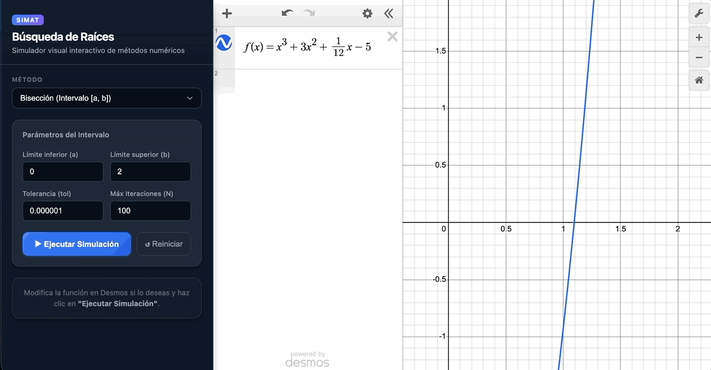

# SIMAT - Your friendly numerical simulator

Hello! **SIMAT** is an interactive web app designed to visually simulate the execution of different root-finding numerical algorithms, in order to analize their geometrical behaviour. This project implements the **Desmos Graphing Calculator API** for the matters of calculus and graphing. At the same time, the development of the visual design is assisted by **Google Antigravity**

## Preview

## Key Features

- ### **Real-time visualization.**

  Each iteration is visually animated plotting its values, aproximations, and the respective input function on the Cartesian plane.

- ### **Dynamic LaTeX math evaluation.**

  The user can input any function they desire thanks to the math parser that translates LaTeX functions for JS.

- ### **Method selection.**

  The input fields are dynamically updated acording to the selected numerical methods and their parameters

- ### **Convergence and results summary.**

  Instand feedback on the calculated result, aproximate values, total iterations and estimated errors.

- ### **Tested algorithms.**

  Numerical methods and the LaTeX parser are verified through automated unit tests implementing **Vitest**.

## Implemented Methods

### 1. Bisection Method

Encloses the root within a closed interval $[a, b]$ where $f(a) \cdot f(b) < 0$, repeatedly bisecting the interval:
$$p_n = a + \frac{a_n + b_n}{2}$$

### 2. Fixed Point Iteration

Transforms $f(x) = 0$ into the equivalent form $x = g(x)$ and iterates from an initial seed $p_0$:
$$p_n = g(p_{n-1})$$
_(Plotted alongside the identity line $y = x$)_.

## Tech Stack

- **Frontend:** [React 19](https://react.dev/)
- **Build Tool:** [Vite](https://vitejs.dev/)
- **Graphing Engine:** [Desmos API v1.12](https://www.desmos.com/api/v1.12/docs/index.html)
- **Unit Testing:** [Vitest](https://vitest.dev/)
- **Styling:** Vanilla CSS3 with custom variables and a _Dark_ theme.

### Prerequisites

- [Node.js](https://nodejs.org/) (v18 or higher) installed.
